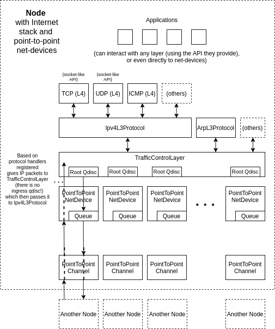

# Chapter 3: Ns-3 basics

ns-3 is a discrete-event **network** simulator. In this chapter we discuss
the absolute basics of ns-3.

Bluntly speaking, ns-3 is nothing but the 8 lines of pseudo-code of chapter 2
written in C++ with a bunch of network concepts around it. The state we kept
referring to is the network in ns-3. Events in ns-3 are aimed to manipulate
what is passed around in networks: packets, it thus also often referred to
as "packet-level simulation". Some event examples to give you a feel for it:
packets arriving, packets getting queued/dequeued, TCP timeouts expiring to
send out a packet, etc..

## `Node` is the core concept

In ns-3, the network is a collection of `Node`s. The `Node` is the core concept of ns-3.
Everything is attached to a `Node`, or attached to things attached to a `Node`.
Think of it as a node in a graph, except there are no edges explicitly defined.

A `Node` has the following state:

- A list of `NetDevice`s

  A `NetDevice` you can think of as physical network port on a computer. This can be
  a thing in which you plug a cable, or which uses radio frequencies to communicate.
  A node communicates to other nodes exclusively through its `NetDevice`s by handing
  `Packet`s to it or receiving `Packet`s from it.

- A list of `Application`s
  
  An `Application` you can equate to "something that can produce packets out of nowhere
  and receive packets taking them out of the network".
  
- A list of protocol handlers

  When a Node gets a `Packet` handed to it from either (a) a `NetDevice` or (b) an `Application`
  it basically asks itself "What do I do with this?". When it gets handed a packet, luckily,
  the `NetDevice` or `Application` tell also what is the outer header. For all intents and 
  purposes, generally the outer header is "IP". Then it looks up in its list of protocol handlers
  "IP", and returns a protocol implementation.
  
  The protocol implementation then gets the `Packet`, and decides to either (a) give it to a local
  Application, (b) pass it along to a `NetDevice` because it should be forwarded to another Node,
  or (c) whatever else the protocol demands: it can drop it (effectively, this means
  just do nothing with it and return), do an `Application`-like thing and generate new `Packet`s
  (for example, ICMP reply, or if it should be broadcast).
  
  A `Node` has multiple protocols attached to it when it has the Internet stack on it:
  * `Ipv4L3Protocol`
  * `ArpL3Protocol`
  * `TcpL4Protocol`
  * `UdpL4Protocol`
  * `Icmpv4L4Protocol`
  * ...
  
  Some of which call each other (e.g., `Ipv4L3Protocol` will read the IP header and then
  forward to `TcpL4Protocol` if the next header is TCP). Although `Application`s are able
  to directly interact with the `Node` generally they interact with a `Protocol`.

## Traffic-control

The Internet stack Protocols when they want to send a packet out, they do not directly
pass it to a `NetDevice` instead they give it to the `TrafficControlLayer`, which maintains
a queue discipline (a more general version of a queue) for each interface. The word interface
corresponds in general to a single `NetDevice`. After passing through the queue (discipline)
in the `TrafficControlLayer` it is actually passed to the `NetDevice`. A `NetDevice` itself
also has an internal queue. As such:

**There are two queues before a Packet is sent out by the `NetDevice`: (1) the queue (discipline)
of the `TrafficControlLayer` for that interface/`NetDevice`, and (2) the `NetDevice`'s own internal
queue implementation**

The `TrafficControlLayer` queueing discipline asks the `NetDevice` queue gets notified if there
is space to accept a Packet. It does not pass a Packet if there is no space. The only drops
occur at the `TrafficControlLayer` queueing discipline for that interface.

**If there is a traffic-control queueing discipline for the `NetDevice` (interface),
the `NetDevice`'s internal queue will never drop a `Packet`!**

## Medium between `Node`s: `Channel`

`NetDevice`s are connected to each other via `Channel`(s). 
The simplest form of a `NetDevice` is point-to-point, connecting only two `NetDevice`s
(you can think of it as a cable between them). However, the `Channel` can be any medium,
such as e.g., representing various frequency spectra for WiFi.

## What is passed around: `Packet`

A `Packet` consists of a payload and headers. Payloads are allocated in memory in a lazy
fashion -- only if they are defined or accessed are they actually allocated.
As such, as long as you don't actually touch the payload, the payload size is just a
number to use for calculations (e.g., `(headers_size + payload_size) / data_rate` 
to determine how long it takes to transmit the packet).

## Overview diagram

Notes:
* Although the `Application`s can interact with any layer, typically we use UDP / TCP, so we
  just interact with them by creating their respective sockets via the API offered by `TcpL4Protocol`
  and `UdpL4Protocol`
* The `Ipv4L3Protocol` takes care of the routing decisions (it contains a `Ipv4RoutingProtocol`); it
  inherits from `Ipv4`
* The IP(v4) stack is installed using `InternetStackHelper`
* There is only an egress queueing discipline in the `TrafficControlLayer`
* There is only an egress queue in the `PointToPointNetDevice`

## Next chapter

[Continue to chapter 4: Building ns-3](4_ns3_building.md)
