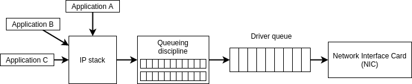

# Chapter 3: What are we going to simulate?

Candidly speaking, like any discrete-event simulator, ns-3 is essentially the
9 lines of pseudo-code of chapter 2, written in C++ with the state consisting
of network concepts and the events being thus network-related. Before we get into
ns-3 itself, we will take a step back and investigate **what** we want to simulate.

In effect, the key thing we want to simulate are (a) endpoints (often, servers)
and (b) switches which connect them (often through cables). For our simulation
purposes, we abstract them to the same thing: a **node** which has several network
devices (interfaces). A switch has many network devices, an endpoint generally just one.

The ns-3 node is modeled after a node running Linux, as such in this chapter we
are going to shortly go over some terminology of how they do things in Linux.
Of course, many proprietary switches do not run Linux, yet the functionality
they offer is similar (or more often: a subset).

This chapter is inspired by an article written by Dan Siemon:

https://www.coverfire.com/articles/queueing-in-the-linux-network-stack/

An even more detailed overview can be found at:

https://blog.packagecloud.io/eng/2016/06/22/monitoring-tuning-linux-networking-stack-receiving-data/

## Overview

The Linux networking overview can be simplified to the following schematic:

The applications generate packets which are then passed onto the IP stack for
forwarding. The IP stack then decides to which interface it wants to send it to.
Of the interface it chooses, it puts it into that interface's queueing discipline
installed by the traffic control layer in front of the network device.
The queueing discipline then schedules releasing packets from its (multiple)
internal queues to the driver queue. The driver queue subsequently
passes it onto the network interface card (NIC) which actually sends out
the packet over whichever medium (e.g., Ethernet, WiFi).

## The Internet Protocol (IP) stack

The IP stack...

* ... maintains an interface for each network device (= NIC) attached to the system
* ... manages IP address assignment to these interfaces
* ... assigns a queueing discipline to each interface
* ... contains forwarding state to decide what to do with packets it receives from
  applications and interfaces
* ... manages sockets and generally the concept of "ports"

## The queueing discipline

The queueing discipline arbitrates **user-space needs**: it continuously determines
which packets from which applications get queued into the driver queue.

This is needed to guarantee good quality of experience for all applications:
* Some of them want low latency (e.g., not get queued behind large flows)
* Some of them want a lot of bandwidth (and e.g., do not mind having a few small
  packets go first)
* The case for it especially becomes clear when there is an application
  not exercising any congestion control: if you have one application blasting
  UDP at 10 Gbit/s without congestion control to your driver queue
  should (in most use cases) not make the net-device unusable for other applications.

Queueing disciplines as such need to distinguish between packets. There are
essentially two ways this is done:

* Make use of the concept of "flow" instead of treating packets solely individually.
  A flow is often defined by the 5-tuple (protocol, IP src/dst, port src/dst).
  Each flow gets its own queue.
  
* Allow applications to set a QoS field (e.g., the DSCP field in the IP header).
  Each priority level has its own queue.
  
These two ways are not mutually exclusive and can be combined as well.

The queueing discipline scheduler decides from which queue it should take packets
based on its policy. It can e.g., be just round-robin, weighted round-robin with 
some queue priority, absolute priority (only if all higher priority queue are empty),
or any other strategy you can think of.

Examples queueing disciplines are:

  - One FIFO queue for all (problematic, as mentioned before)
  
  - PFifoFast (used to be Linux default): effectively 3 FIFO queues and IP packets
    are put into them based on their DSCP field value. Absolute prioritization
    meaning that it only releases packets from a lower priority queue if all
    higher priority queues are empty.
    
  - FqCoDel (Linux default): maintains a FIFO queue for each flow, and dynamically
    changes the maximum size of this FIFO queue based on the queueing delay observed.

Some traffic-control queueing disciplines make use of more complex queues
offered by the driver for off-loading (hardware acceleration).

## The driver queue and the NIC

The driver queue exists such that if the NIC is able to send
data (the medium is free), it has data available to it to send.
The driver queue notifies the queueing discipline whenever
spots free up in it.
The alternative design, in which the NIC directly contacts
the IP stack for data each time it's free, would take too long
and result in the NIC being not fully utilized. 

Like any FIFO queue, a long driver queue results in long latency.
A short driver queue on the other hand results in an underutilized NIC.
As such, the IP stack's queueing discipline can decide not to
always completely fill up the driver queue completely.

## Navigation

**Continue to the next chapter:**

[&#187; Chapter 4: Ns-3 basics](4_ns3_basics.md)

**Full menu:**

* [Chapter 1: The toolbox](1_toolbox.md)
* [Chapter 2: What is discrete-event simulation?](2_discrete_event_simulation.md)
* [Chapter 3: What are we going to simulate?](3_what_to_simulate.md)
* [Chapter 4: Ns-3 basics](4_ns3_basics.md)
* [Chapter 5: Building ns-3](5_ns3_building.md)
* [Chapter 6: First ns-3 tutorial](6_ns3_tutorial.md)
* [Chapter 7: Adding your own ns-3 module](7_ns3_adding_your_own_module.md)
* [Chapter 8: Writing a manual script](8_ns3_script_manually.md)
* [Chapter 9: Introducing basic-sim](9_ns3_introducing_basic_sim.md)
* [Chapter 10: Writing a script with basic-sim](10_ns3_script_with_basic_sim.md)
* [Chapter 11: Further readings](11_further_readings.md)
* [Chapter 12: Test your knowledge](12_test_your_knowledge.md)
